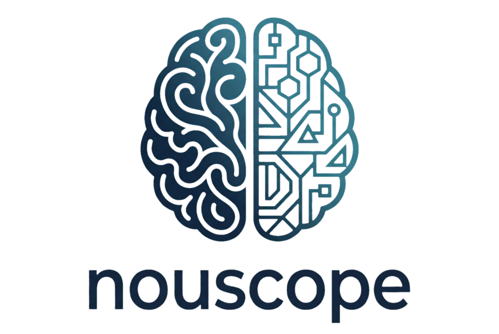

<picture>
  <source media="(prefers-color-scheme: dark)" srcset="./assets/nouscope-logo-two-colour-inverted.png">
  <source media="(prefers-color-scheme: light)" srcset="./assets/nouscope-logo-primary.png">
  
</picture>

# Signals that matter. Surfaced from the noise.

**Senior experience. Every patient.**

[nouscope.ai](https://nouscope.ai) · [LinkedIn](https://www.linkedin.com/company/nouscopeai)

---

## What we are building

Nouscope connects to the clinical systems and workflows doctors already use. It learns what each doctor cares about. It surfaces the signals that cross their threshold, into the practice management software they already have.

The doctor sets what matters. Nouscope applies that experience across every patient, every signal, every record.

## The engineering problem

Senior doctors catch what their juniors don't. Not because they remember more. Because thousands of patients have taught them what signals they shouldn't ignore. That is something current AI cannot emulate by reading more papers.

We are building the framework that encodes senior clinical experience in software, and applies it across every clinical system the patient touches.

## Where we are

LuminaX 2026 cohort. Mid-program.

Origins: the engine was first built under a Queensland Government innovation grant. Fifteen years shipping software in regulated environments behind it.

## For builders

If you are building in clinical AI, healthcare integration or regulated software, we want to compare notes.

[LinkedIn](https://www.linkedin.com/company/nouscopeai).

---

Nouscope. Gold Coast, Australia. 2026.
